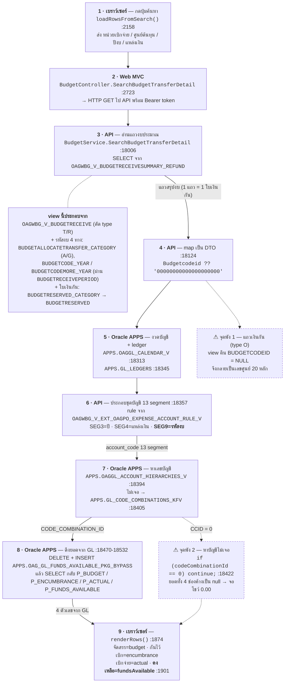

# ลำดับการทำงาน: กดปุ่ม "ค้นหา" → ตารางที่ 1 มีข้อมูลแสดง

หน้า **โอนปรับเงินเหลือจ่าย** (`BudgetReserveTransferDetail.cshtml`)
ตรวจสอบกับ PREPROD เมื่อ 2026-09-08 (DDL ของ view + ข้อมูลจริง)

> **ใจความ:** 4 คอลัมน์ยอด (จัดสรร / กันไว้เบิก / เบิกจ่าย / คงเหลือ) **ไม่ได้มาจากถังเว็บ**
> แต่มาจาก EBS GL ต่อ "ชุดบัญชี 13 segment" ที่ประกอบขึ้นใหม่ทุกครั้งที่กดค้นหา
> ถ้าประกอบชุดบัญชีแล้วหาไม่เจอ → โค้ดข้ามแถวนั้น → หน้าจอโชว์ 0.00

---

## แผนภาพ



---

## ตารางที่เกี่ยวข้อง (เรียงตามลำดับที่ถูกอ่าน)

| # | ตาราง / view | ฝั่ง | บทบาทในขั้นตอนนี้ |
|---|---|---|---|
| 1 | `OAGWBG_V_BUDGETRECEIVESUMMARY_REFUND` | OAGWBG | แหล่งแถวหลักของตารางที่ 1 — group ระดับ **ใบเงินกัน** |
| 2 | `OAGWBG_V_BUDGETRECEIVE` → `OAGWBG_BUDGETRECEIVE` | OAGWBG | ถังงบจริง (ตัด type `T`/`R` ออก) — `TOTALBALANCEAMOUNT` **ไม่ได้ถูกแสดงบนจอ** |
| 3 | `OAGWBG_BUDGETALLOCATETRANSFER_CATEGORY` | OAGWBG | รหัสงบของแถว type `A` / `G` |
| 4 | `OAGWBG_BUDGETRECEIVEPERIOD` + `OAGWBG_BUDGETCODE_YEAR` / `OAGWBG_BUDGETCODEMORE_YEAR` | OAGWBG | รหัสงบของแถวอื่น — **แถว type `O` (เงินกัน) เข้าไม่ถึงทั้ง 2 ทาง** |
| 5 | `OAGWBG_BUDGETRESERVED_CATEGORY` → `OAGWBG_BUDGETRESERVED` | OAGWBG | เลขที่ใบเงินกัน + ปีของใบ (มี `BUDGETCODEID` ที่ถูกต้องอยู่ แต่ view ไม่ได้หยิบมาใช้) |
| 6 | `OAGWBG_V_EXT_OAGPO_EXPENSE_ACCOUNT_RULE_V` | OAGWBG | rule ของ SEGMENT 5/8/10/11 (แผนงาน/ประเภทงบ/บัญชี/บัญชีย่อย) |
| 7 | `APPS.OAGGL_CALENDAR_V` | EBS | งวดบัญชีล่าสุดของปีที่ค้น (ตัด ADJ1–ADJ4) |
| 8 | `APPS.GL_LEDGERS` | EBS | LEDGER_ID |
| 9 | `APPS.OAGGL_ACCOUNT_HIERARCHIES_V` / `APPS.GL_CODE_COMBINATIONS_KFV` | EBS | แปลงชุดบัญชี 13 segment → `CODE_COMBINATION_ID` |
| 10 | `APPS.OAG_GL_FUNDS_AVAILABLE_PKG_BYPASS` | EBS | เขียนแล้วอ่านกลับ — ที่มาของยอดทั้ง 4 คอลัมน์ |

---

## ผลจริงกับแหล่งเงิน 400 (จำลองขั้นที่ 6-7 กับข้อมูล PREPROD)

| ผลการหาเลขบัญชี | จำนวนแถว | หน้าจอแสดง |
|---|---|---|
| เจอ `CODE_COMBINATION_ID` | **8** | ตัวเลขจริงจาก GL |
| ไม่เจอ → `continue` | **20** | 0.00 ทั้ง 4 ช่อง |

ชุดบัญชีของแถวเงินกันที่หาไม่เจอ (SEG9 เป็นศูนย์):

```
2900600000.2906999999.68.400.20000.21000.21100.212001.00000000000000000000.5104010107.230003.00.000
                                                      ^^^^^^^^^^^^^^^^^^^^ ← ควรเป็น 29006630001004100280
```

บัญชี `...68.400.*` ที่มีอยู่จริงใน GL มี 7 บัญชี — **ไม่มีสักบัญชีที่ SEGMENT9 เป็นเลขศูนย์**

---

## สิ่งที่แผนภาพนี้อธิบายได้

- **ทำรายการบนเว็บแล้วยอด 4 ช่องไม่ขยับ** — ถูกต้องตามกลไก เพราะ 4 ช่องอ่านจาก GL ไม่ได้อ่านถังเว็บ
  และหน้านี้ไม่ได้ส่ง journal เข้า GL เอง (ดู §5 ของ `analysis_root_cause.md`)
- **แถวเงินกันโชว์ 0.00** — ตกที่จุดพัง 1 → 2 (รหัสงบเป็นศูนย์ → หาบัญชีไม่เจอ → ข้ามแถว)
- **แถวที่ยังมียอดแสดง** — คือแถวที่รหัสงบมาจากทาง `A`/`G` ซึ่งประกอบชุดบัญชีได้สำเร็จ
