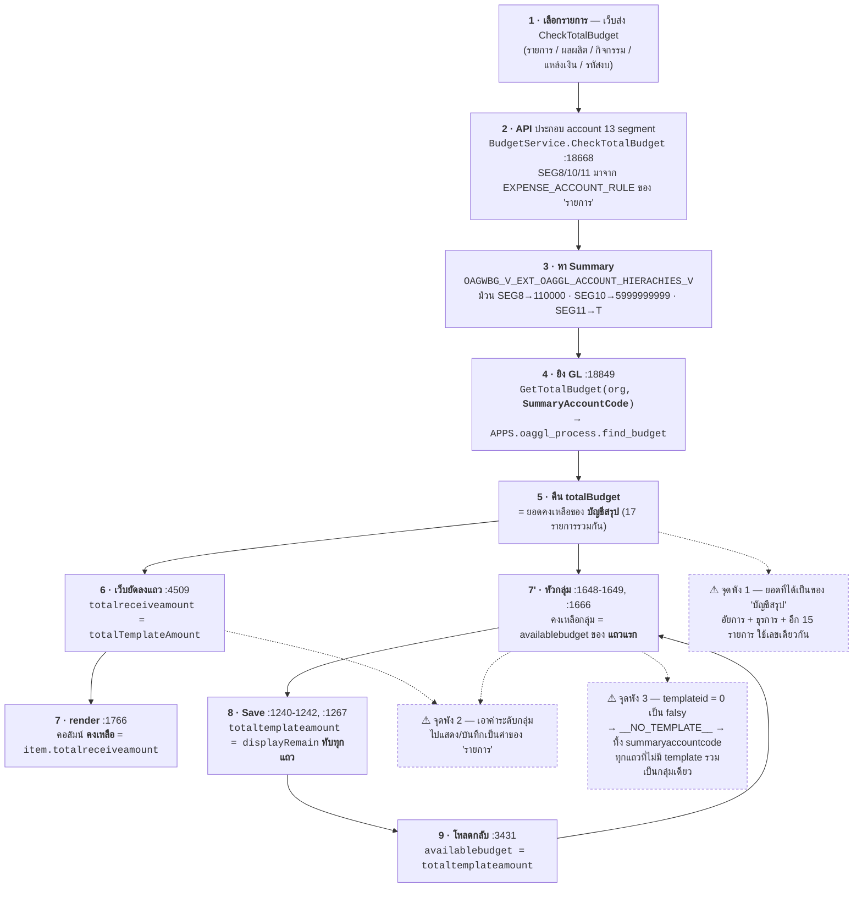

# หน้าโอนจัดสรร — ยอด "คงเหลือ" ของรายการหนึ่งไปแสดงบนอีกรายการหนึ่ง

**อาการที่แจ้ง**
หน้า **โอนเงินจัดสรรงบประมาณ** (`BudgetAllocateTransferDetail.cshtml`)
ใบโอน `6911808` `6911759` `6911836` = เงินสวัสดิการฯ พื้นที่พิเศษ **(พนักงานอัยการ)**
ใบโอน `6911678` = เงินสวัสดิการฯ พื้นที่พิเศษ **(ข้าราชการธุรการ)**
→ **ยอดของธุรการไปแสดงในช่อง "คงเหลือ" ของพนักงานอัยการ**

**วันที่วิเคราะห์:** 2026-09-08
**ตรวจกับ:** Oracle PREPROD (172.16.11.19:1541 / `ebs_PRE`) — เฉพาะ master data + source ของ function/view

> **ใจความ:** ช่อง "คงเหลือ" **ไม่ได้อ่านยอดของรายการงบประมาณ**
> แต่อ่านยอดของ **บัญชีสรุป (SUMMARY_ACCOUNT_CODE)** ซึ่ง EBS ม้วนรวมหลายรายการเข้าเป็นบัญชีเดียว
> "พนักงานอัยการ" กับ "ข้าราชการธุรการ" ม้วนไปบัญชีสรุป **ตัวเดียวกัน** ยอดคงเหลือจึงเป็นก้อนเดียวกัน
> แล้วหน้าจอ + ตอน Save ยังเอาค่าระดับกลุ่มนั้นไป **ทับทุกแถวในกลุ่ม** อีกชั้นหนึ่ง

---

## ⚠️ ข้อจำกัดของการตรวจสอบครั้งนี้

| ประเด็น | สถานะ |
|---|---|
| ใบโอน 4 ใบที่แจ้ง | **ไม่มีใน PREPROD** — ค้น `CATEGORYID IN (5124,5125)` ใน `OAGWBG_BUDGETALLOCATETRANSFER_CATEGORY` ได้ 0 แถว และ `OAGWBG_BUDGETRESERVED.TRANSFERNO` มีแค่ชุด `68xxxx` / `69030xxx` ไม่มี `69118xx` |
| ข้อมูลจริง | อยู่ **PROD** (172.16.11.18:1531 / `PROD`) — ยังไม่ได้เข้าไปอ่าน |
| สิ่งที่ยืนยันแล้ว | master data (EAR rule + account hierarchy) บน PREPROD + source code ของ function / API / View |
| สิ่งที่ยังไม่ยืนยัน | ตัวเลขจริงของ 4 ใบนั้น → ยังชี้ไม่ได้ 100% ว่าเป็นเส้นทาง **A (แถวรายการ)** หรือ **B (แถวหัวกลุ่ม)** — ดู §5 |

---

## 1. หลักฐานจาก Database

### 1.1 สองรายการนี้ต่างกันแค่ "บัญชีย่อย" ช่องเดียว

```sql
SELECT * FROM OAGWBG_V_EXT_OAGPO_EXPENSE_ACCOUNT_RULE_V WHERE CATEGORYID IN (5124,5125);
```

| CATEGORYID | รายการงบประมาณ | BUDGETTYPEID | BUDGETCODE | ACCOUNTNO | SUBACCOUNTNO |
|---|---|---|---|---|---|
| **5124** | เงินสวัสดิการฯ พื้นที่พิเศษ **(พนักงานอัยการ)** | 110001 | 29006140002004100026 | 5101020199 | **110028** |
| **5125** | เงินสวัสดิการฯ พื้นที่พิเศษ **(ข้าราชการธุรการ)** | 110001 | 29006140002004100026 | 5101020199 | **110029** |

(`OAGWBG_V_EXT_OAGINV_CATEGORY_CODES_V` → `EXP.100.110001.0000000022` = อัยการ, `...0023` = ธุรการ, BUDGET_PLAN_ID 3123 / EXPENSE_TYPE 10 ค่าใช้จ่ายบุคลากร เหมือนกันทั้งคู่)

### 1.2 EBS ม้วนบัญชีย่อยทิ้งตอนทำ Summary Account

```sql
SELECT COUNT(DISTINCT SUMMARY_ACCOUNT_CODE), COUNT(DISTINCT TEMPLATE_ID), COUNT(*)
FROM OAGWBG_V_EXT_OAGGL_ACCOUNT_HIERACHIES_V
WHERE ACCOUNT_CODE LIKE '2900600000.2906999999.69.100.10000.11000.11100.110001.29006140002004100026.%';
```

| DISTINCT_SUMMARY | DISTINCT_TPL | TOTAL_ACCOUNTS |
|---|---|---|
| **1** | **1** | **17** |

**บัญชีย่อย 17 บัญชี (17 รายการงบประมาณ) → บัญชีสรุปตัวเดียว + template ตัวเดียว**

```
ACCOUNT_CODE  2900600000.2906999999.69.100.10000.11000.11100.110001.29006140002004100026.5101020199.110028.00.000
                                                                    ^^^^^^ SEG8     ^^^^^^^^^^ SEG10 ^^^^^^ SEG11
SUMMARY       T290060000.T290060000.69.100.10000.11000.11100.110000.29006140002004100026.5999999999.T.T.T
                                                            ม้วน→110000            ม้วน→5999999999  ม้วน→T
TEMPLATE_ID   3021   TEMPLATE_NAME  000-ค่าใช้จ่ายบุคลากร
```

**⇒ อัยการ (110028) และ ธุรการ (110029) ได้ `SUMMARY_ACCOUNT_CODE` + `TEMPLATE_ID` เดียวกันเป๊ะ**

---

## 2. แผนภาพ — ยอดเดินทางอย่างไร



---

## 3. เส้นทางในโค้ด (ทีละจุด)

| # | ไฟล์ : บรรทัด | สิ่งที่เกิดขึ้น |
|---|---|---|
| 1 | `OAGBudget.API/Services/Repository/BudgetService.cs` **:18849** | `GetTotalBudget(userInfo?.User?.OrgId ?? "81", sumAccountSegment?.SummaryAccountCode ?? accountSegment)` → `find_budget()` ยิงที่ **บัญชีสรุป** ไม่ใช่บัญชีของรายการ |
| 2 | `.../BudgetService.cs` **:18892-18894** | คืน `AccountSegment = SummaryAccountCode`, `TemplateId`, `TotalBudget` กลับไปให้เว็บ |
| 3 | `Views/Budget/BudgetAllocateTransferDetail.cshtml` **:4351** | `totalTemplateAmount = res.data.totalBudget` (= ยอดบัญชีสรุป) |
| 4 | `...Detail.cshtml` **:4509** | `totalreceiveamount: lastCheckTotalBudgetResultTransfer.totalTemplateAmount \|\| 0` ← **ยัดยอดบัญชีสรุปลงฟิลด์ของรายการ** |
| 5 | `...Detail.cshtml` **:1766** | คอลัมน์ **คงเหลือ** ของแถวรายการ render จาก `item.totalreceiveamount` (header อยู่ที่ :287) |
| 6 | `...Detail.cshtml` **:1648-1649** | `items.find(it => it.availablebudget != null && !isNaN(...))` — หลัง `Number(… ?? 0)` ที่ **:1539** ค่าไม่มีวันเป็น null/NaN ⇒ ได้ `items[0]` **เสมอ** |
| 7 | `...Detail.cshtml` **:1666** | คงเหลือของ **แถวหัวกลุ่ม** = `displayRemain` (ค่าของแถวแรกเท่านั้น) |
| 8 | `...Detail.cshtml` **:1240-1242, :1267** | ตอน Save เขียน `totaltemplateamount = displayRemain` **ทับทุกแถวในกลุ่ม** |
| 9 | `...Detail.cshtml` **:3431** | โหลดกลับ `availablebudget = item.totaltemplateamount` → ค่าที่ปนกันกลายเป็นถาวร |
| 10 | `.../BudgetService.cs` **:11632** | ปุ่ม "อัพเดทงบประมาณ" เขียน `cat.Totaltemplateamount = ListAvailableBudget[cat.SummaryAccountCode]` — key เป็น Summary เหมือนกัน |

### ทำไมเลขที่เห็นเป็น "ยอดของธุรการ" พอดี

ถ้าฝั่งอัยการ (`6911808` / `6911759` / `6911836`) จัดสรรไปหมดแล้ว
→ ยอดคงเหลือของ **บัญชีสรุป** ที่เหลืออยู่ = ส่วนของธุรการ (`6911678`) พอดี
→ ระบบเอาเลขนั้นไปแปะทุกแถวในกลุ่ม รวมถึงแถวของอัยการ

---

## 4. ตัวเร่งที่ทำให้ลามกว้างกว่าเดิม — `templateid = 0` เป็น falsy

`Views/Budget/BudgetAllocateTransferDetail.cshtml:1449-1453`

```js
function getTemplateGroupKey(tplId, summaryCode) {
    const t = (tplId != null ? String(tplId) : '').trim();
    if (t === '' || t === '__NO_TEMPLATE__') return '__NO_TEMPLATE__||';   // ← ทิ้ง summaryCode ทิ้ง
    return `${t}||${(summaryCode != null ? summaryCode : '')}`;
}
```

- ฝั่ง DB: `OAGWBG_FN_GETBUDGET_ALLOCATE_TRANSFER_CATEGORY` คืน `NVL(ah.TEMPLATE_ID, 0)` → **หา hierarchy ไม่เจอ = 0**
- ฝั่ง JS: `const tplId = r.templateid || r.templateId || '';` → **`0` เป็น falsy → กลายเป็น `''`**
- `CheckTotalBudget` ก็ normalize `templateId === '0'` เป็น `'__NO_TEMPLATE__'` เอง (`:4347`)

**⇒ ทุกแถวที่หา account hierarchy ไม่เจอ — คนละรายการ คนละใบโอน คนละแหล่งเงิน — ตกลงกลุ่ม `__NO_TEMPLATE__||` เดียวกันหมด และใช้ "คงเหลือ" ตัวเดียวกัน**

---

## 5. ยังต้องยืนยันอะไรอีก

### 5.1 ต้องรู้ว่าเลขที่เห็นอยู่แถวไหน

| ถ้าอยู่ที่... | แปลว่าเป็นเส้นทาง | จุดที่ต้องแก้ |
|---|---|---|
| **แถวรายการ** (มีคอลัมน์ เลขที่ / รายการงบประมาณ) | เส้นทาง **A** — `:4509` ยัด `totalTemplateAmount` ลง `totalreceiveamount` | แยกยอด "คงเหลือของรายการ" ออกจาก "คงเหลือของบัญชีสรุป" |
| **แถวหัวกลุ่ม** (`ประเภทค่าใช้จ่าย : ...`) | เส้นทาง **B** — `:1648-1649` + `:1240-1242` | เลิกใช้ค่าแถวแรกเป็นตัวแทนกลุ่ม |

> หมายเหตุ: แถวหัวกลุ่ม **พับไว้เป็นค่าเริ่มต้น** (`:1651 isCollapsed = true` เมื่อไม่เคยกาง) — ผู้ใช้จึงเห็นเฉพาะหัวกลุ่มก่อน

### 5.2 Query ที่ต้องรันบน PROD (read-only) เพื่อปิดเคส

```sql
-- 1) header ของ 4 ใบ
SELECT ID, ROUNDNO, BUDGETYEAR, TRANSFERSTATUS, TOTALRECEIVEAMOUNT, BUDGETSOURCEID
FROM   OAGWBG_BUDGETALLOCATETRANSFER
WHERE  ROUNDNO IN (6911808, 6911759, 6911836, 6911678);

-- 2) รายการในใบ + ค่าที่ใช้จัดกลุ่ม/แสดงคงเหลือ
SELECT t.ROUNDNO, c.ID, c.CATEGORYID, c.TRANSFERNO,
       c.TEMPLATEID, c.SUMMARYACCOUNTCODE,
       c.TOTALRECEIVEAMOUNT   AS "คงเหลือที่แสดงในแถว",
       c.TOTALTEMPLATEAMOUNT  AS "คงเหลือระดับกลุ่ม",
       c.TOTALALLOCATEAMOUNT, c.BUDGETCODEID, c.REF
FROM   OAGWBG_BUDGETALLOCATETRANSFER_CATEGORY c
JOIN   OAGWBG_BUDGETALLOCATETRANSFER t ON t.ID = c.BUDGETALLOCATETRANSFERID
WHERE  t.ROUNDNO IN (6911808, 6911759, 6911836, 6911678)
ORDER  BY t.ROUNDNO, c.ID;

-- 3) ยืนยันว่า 2 รายการนี้ม้วนไปบัญชีสรุปเดียวกันบน PROD ด้วย
SELECT h.ACCOUNT_CODE, h.SUMMARY_ACCOUNT_CODE, h.TEMPLATE_ID, r.CATEGORYID, r.SUBACCOUNTNO
FROM   OAGWBG_V_EXT_OAGPO_EXPENSE_ACCOUNT_RULE_V r
JOIN   OAGWBG_V_EXT_OAGGL_ACCOUNT_HIERACHIES_V  h
       ON h.ACCOUNT_CODE LIKE '%.' || r.ACCOUNTNO || '.' || r.SUBACCOUNTNO || '.00.000'
WHERE  r.CATEGORYID IN (5124, 5125);
```

**คาดว่าจะเห็น:** `SUMMARYACCOUNTCODE` และ `TEMPLATEID` ของทั้ง 4 ใบ **เท่ากันหมด**
และ `TOTALTEMPLATEAMOUNT` **เท่ากันหมดทุกแถว** = เลขที่ผู้ใช้บอกว่าเป็น "ยอดของธุรการ"

---

## 6. จุดที่พบเพิ่ม (คนละเรื่อง แต่ทำให้ตัวเลขไม่นิ่ง)

`org_id` ที่ส่งเข้า `find_budget` **ไม่ตรงกันระหว่าง 2 เส้นทาง**

| เส้นทาง | ไฟล์ : บรรทัด | org_id |
|---|---|---|
| ตอนกด "เพิ่มรายการ" (`CheckTotalBudget`) | `BudgetService.cs:18849` | `userInfo?.User?.OrgId ?? "81"` |
| ตอนกด "อัพเดทงบประมาณ" (`GetBulkTotalBudget`) | `BudgetService.cs:11614` | **hardcode `"82"`** |
| ตอนโหลด modal (`GetBudgetTransferCategory`) | `BudgetService.cs:11226` | **hardcode `"82"`** |

⇒ บัญชีเดียวกันแต่ได้ยอดคงเหลือคนละค่า ขึ้นกับว่าผู้ใช้กดปุ่มไหน

---

## 7. สรุปสั้น

1. **สาเหตุราก** — "คงเหลือ" อ่านจาก `SUMMARY_ACCOUNT_CODE` ซึ่ง EBS ม้วนรายการย่อย 17 รายการเป็นบัญชีเดียว → อัยการกับธุรการใช้ยอดก้อนเดียวกันโดยธรรมชาติ
2. **สาเหตุที่ทำให้เห็นเป็น "ยอดของอีกคน"** — โค้ดเอายอดระดับบัญชีสรุป/ระดับกลุ่ม ไปแสดงและบันทึกเป็นยอดของ "รายการ" (`:4509`, `:1648-1649`, `:1240-1242`)
3. **ตัวเร่ง** — `templateid = 0` เป็น falsy ทำให้กลุ่มยุบรวมกว้างเกินจริง (`:1449-1453`)
4. **ยังไม่ได้แก้โค้ดใด ๆ** — รอยืนยันว่าเลขที่ผู้ใช้เห็นอยู่ที่แถวรายการหรือแถวหัวกลุ่ม เพื่อไม่ให้แก้ผิดจุด
