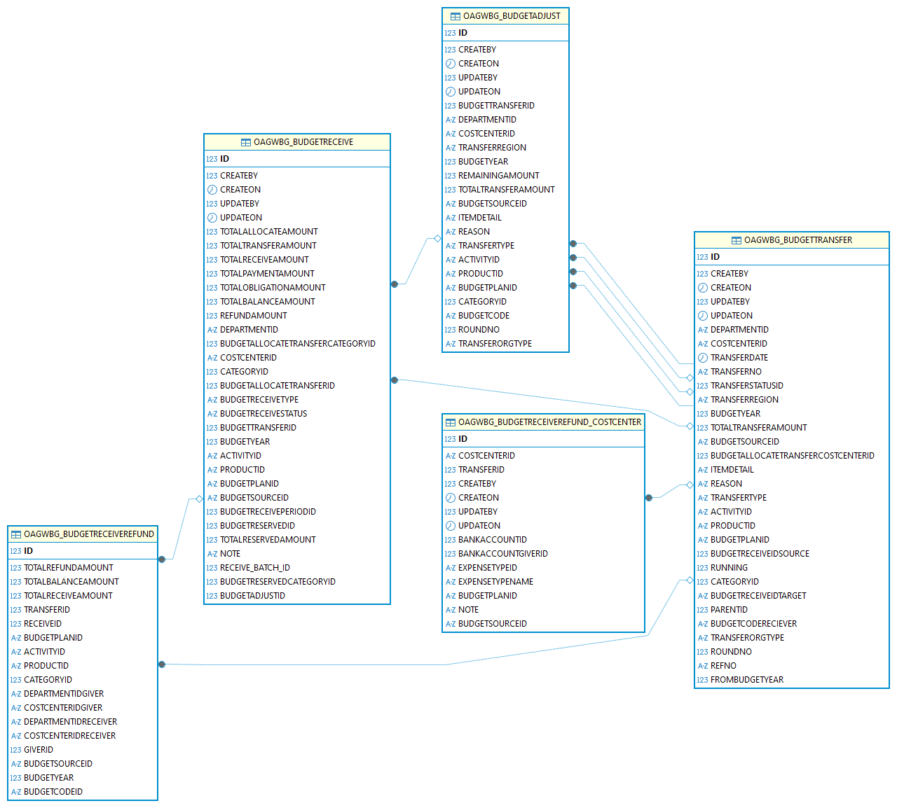
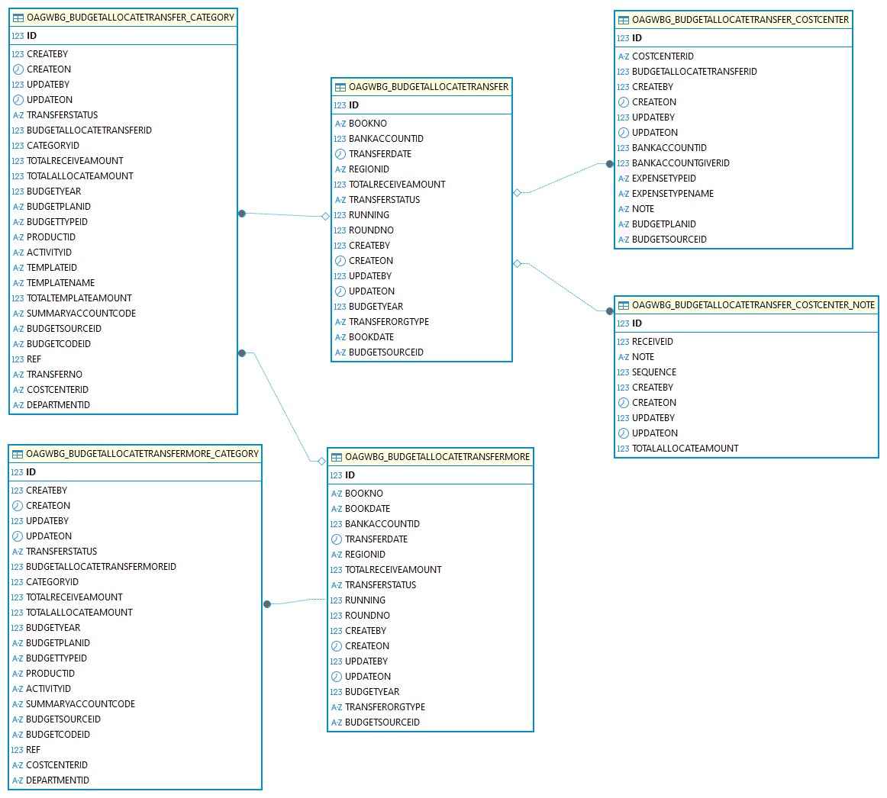
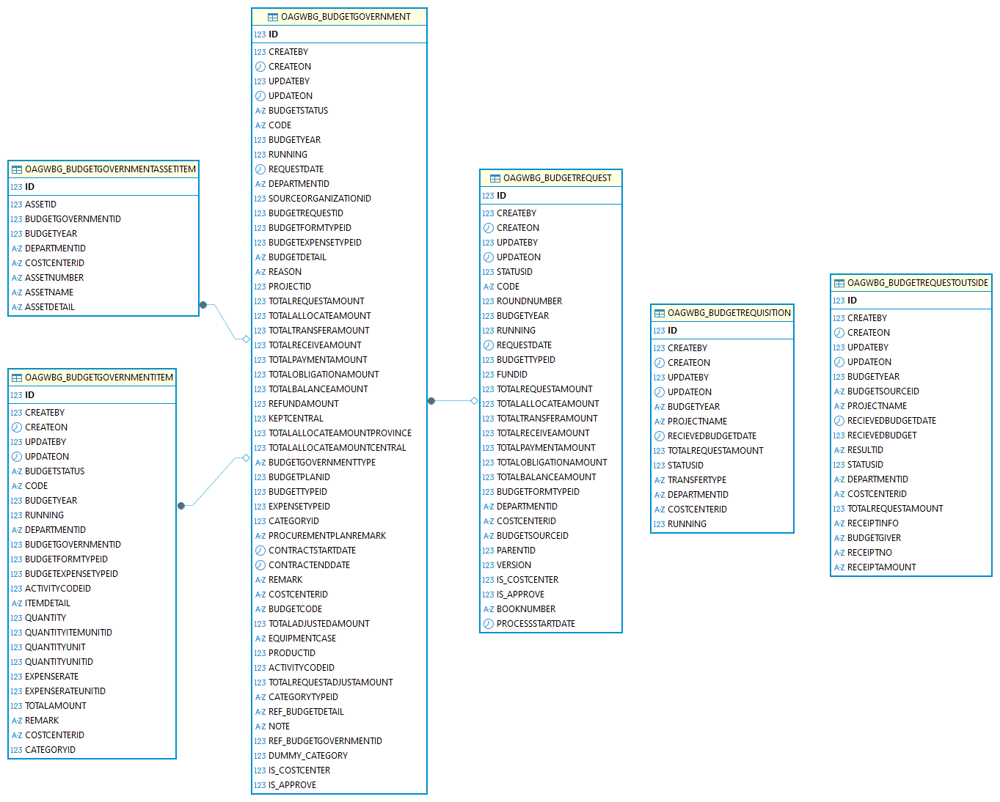
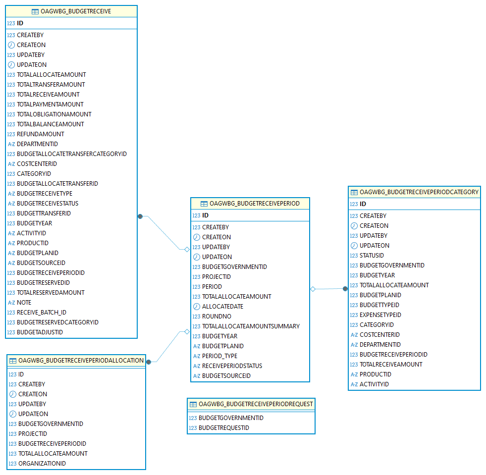
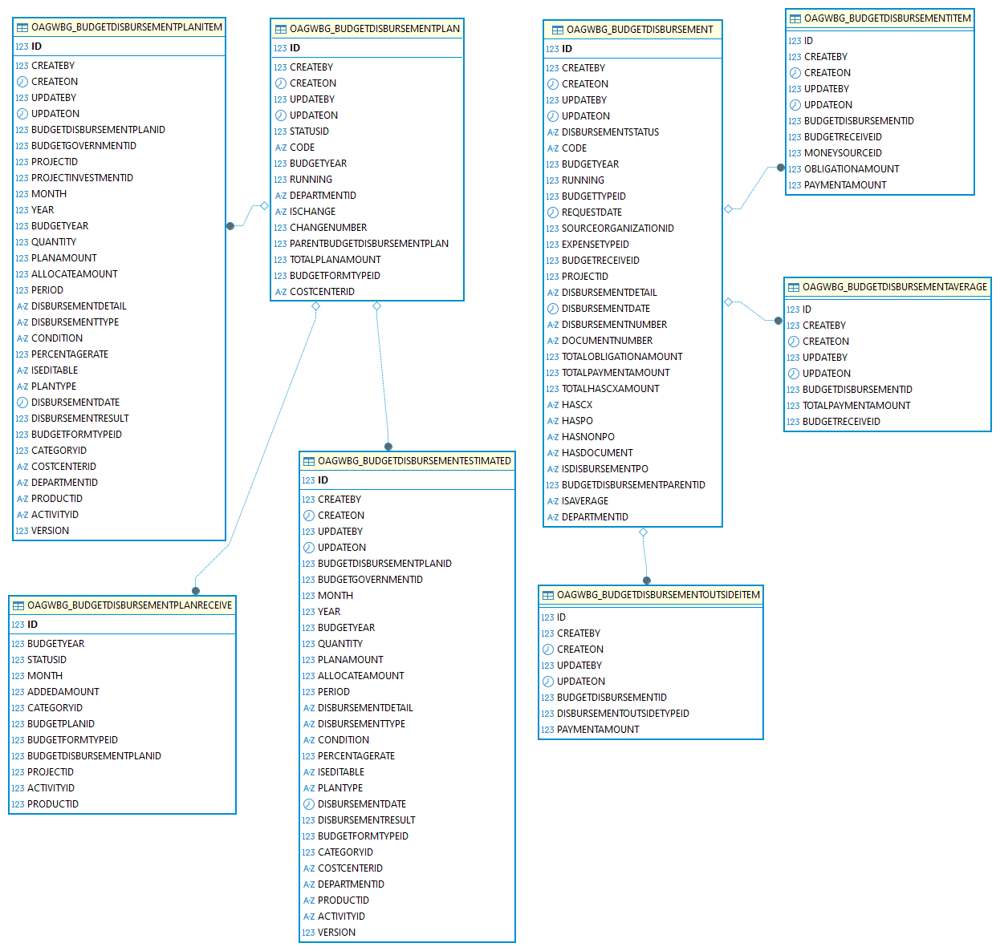
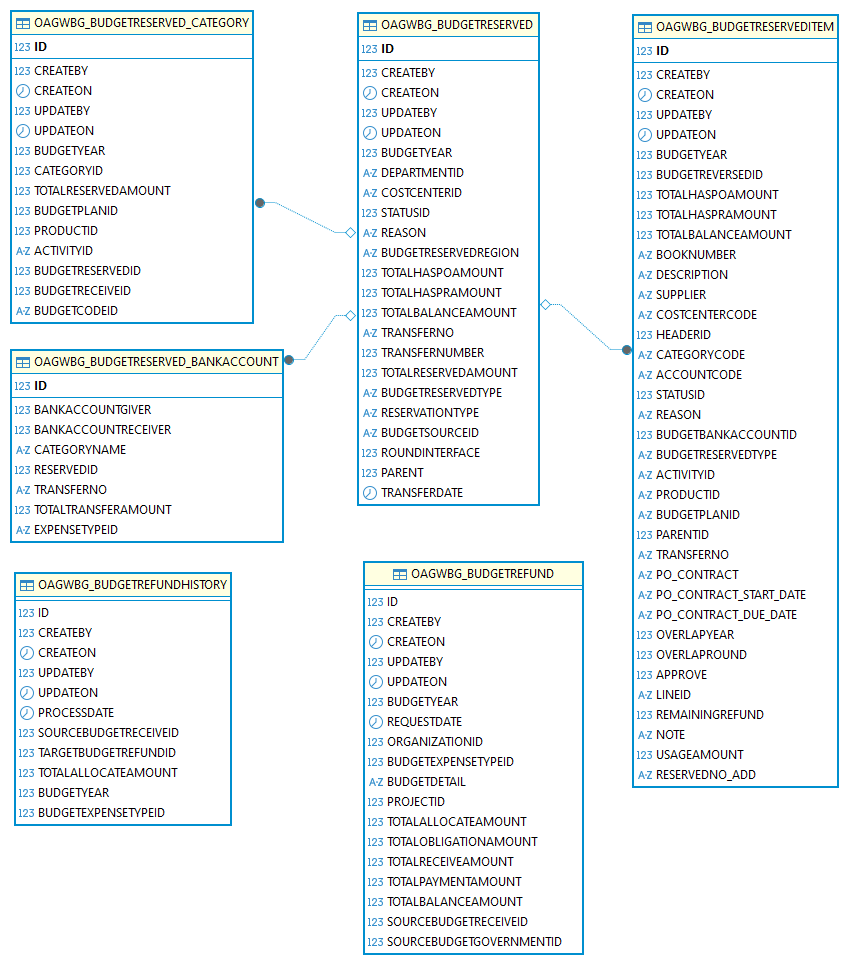
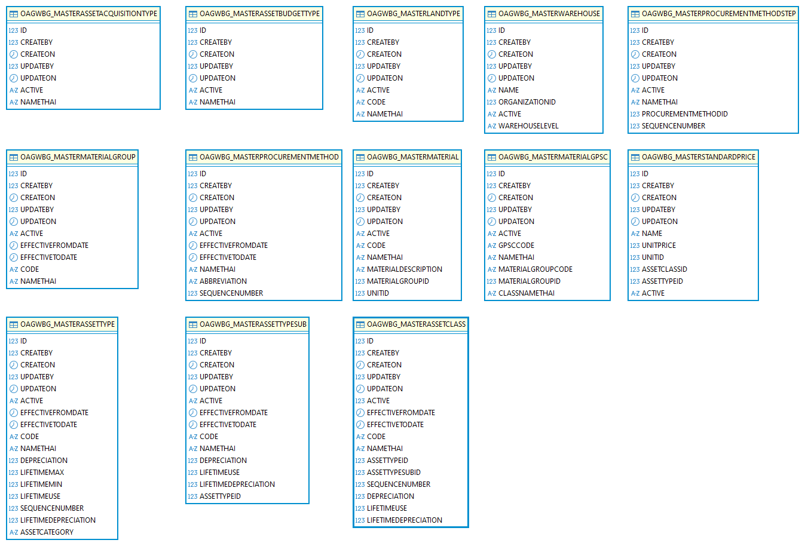
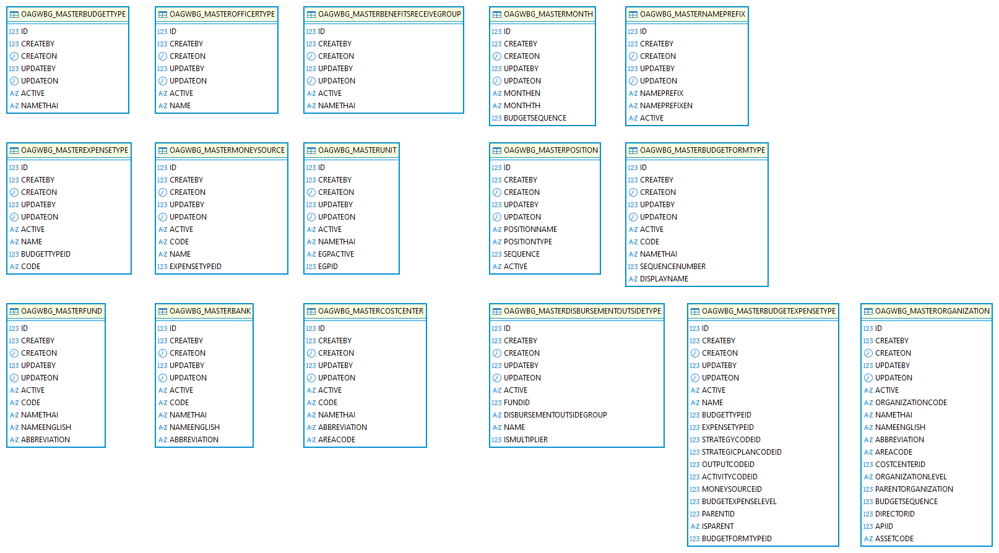
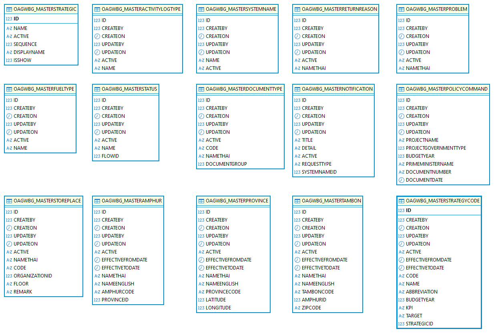
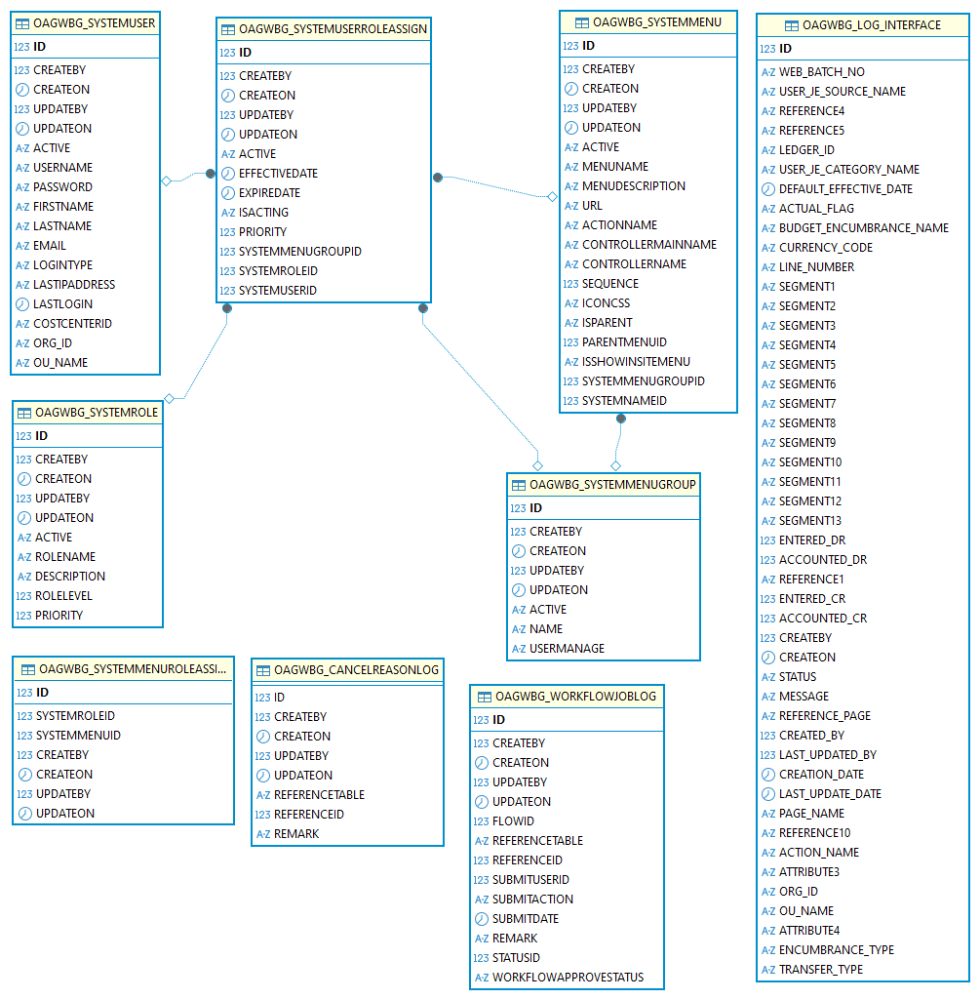

# ER Diagram Results — ระบบ OAGWBG

---

## สรุปความคืบหน้า

| สถานะ | โมดูล | ชื่อ | ตาราง | Virtual FK |
|:---:|:---:|---|---|---|
| ✅ | M1 | โอน/รับโอนงบ | 5 | 6 เส้น |
| ✅ | M2 | จัดสรร/โอนจัดสรร | 6 | 4 เส้น |
| ✅ | M3 | คำของบประมาณ | 6 | 5 เส้น |
| ✅ | M4 | รับงบ/รอบงบ | 5 | 3 เส้น |
| ✅ | M5 | แผนเบิกจ่าย | 8 | 6 เส้น |
| ✅ | M6 | กันเงิน/คืนงบ | 6 | 3 เส้น |
| ✅ | M8a | Master: สินทรัพย์-จัดซื้อ-วัสดุ | ~15 | - |
| ✅ | M8b | Master: งบ-การเงิน-องค์กร-บุคลากร | ~15 | - |
| ✅ | M8c | Master: ที่อยู่-กลยุทธ์-ระบบ-อื่นๆ | ~15 | - |
| ✅ | M9 | ผู้ใช้/สิทธิ์ | 9 | 6 เส้น |
<!-- | ⬜ | M7 | สินทรัพย์ (ยุบ M7a+M7b) | 4 (DB) / 20 code-only | 3 เส้น | -->

---

## M1 — โอน/รับโอนงบประมาณ

### ตารางในรูป (5 ตาราง)

| ตาราง | บทบาท |
|---|---|
| `OAGWBG_BUDGETTRANSFER` | Header หลัก — 1 row ต่อ 1 รายการโอน |
| `OAGWBG_BUDGETADJUST` | Detail ของ TransferOut |
| `OAGWBG_BUDGETRECEIVE` | TransferIn (รับโอน) |
| `OAGWBG_BUDGETRECEIVEREFUND` | เชื่อม TransferIn → รหัสงบ |
| `OAGWBG_BUDGETRECEIVEREFUND_COSTCENTER` | บัญชีธนาคารต่อ Cost Center |

---

## M2 — จัดสรร/โอนจัดสรร

### ตารางในรูป (6 ตาราง)

| ตาราง | บทบาท |
|---|---|
| `OAGWBG_BUDGETALLOCATETRANSFER` | Header โอนจัดสรร |
| `OAGWBG_BUDGETALLOCATETRANSFER_CATEGORY` | หมวดงบของโอนจัดสรร |
| `OAGWBG_BUDGETALLOCATETRANSFER_COSTCENTER` | Cost center ของโอนจัดสรร |
| `OAGWBG_BUDGETALLOCATETRANSFER_COSTCENTER_NOTE` | หมายเหตุ cost center |
| `OAGWBG_BUDGETALLOCATETRANSFERMORE` | รายการเพิ่มเติม |
| `OAGWBG_BUDGETALLOCATETRANSFERMORE_CATEGORY` | หมวดของรายการเพิ่มเติม |

---

## M3 — คำของบประมาณ

### ตารางที่ต้องเลือกใน DBeaver (6 ตาราง)

| ตาราง | บทบาท |
|---|---|
| `OAGWBG_BUDGETREQUEST` | คำของบประมาณหลัก |
| `OAGWBG_BUDGETREQUESTOUTSIDE` | คำของบประมาณนอกแผน |
| `OAGWBG_BUDGETREQUISITION` | ใบเบิก/ขอซื้อ |
| `OAGWBG_BUDGETGOVERNMENT` | งบรัฐบาล |
| `OAGWBG_BUDGETGOVERNMENTITEM` | รายการงบรัฐบาล |
| `OAGWBG_BUDGETGOVERNMENTASSETITEM` | รายการสินทรัพย์ในงบรัฐบาล |

---

## M4 — รับงบ/รอบงบ (Receive Period)

### ตารางในรูป (5 ตาราง)

| ตาราง | บทบาท |
|---|---|
| `OAGWBG_BUDGETRECEIVE` | รับงบ (ใช้ร่วมกับ M1) |
| `OAGWBG_BUDGETRECEIVEPERIOD` | รอบการรับงบ |
| `OAGWBG_BUDGETRECEIVEPERIODALLOCATION` | การจัดสรรในรอบ |
| `OAGWBG_BUDGETRECEIVEPERIODCATEGORY` | หมวดในรอบ |
| `OAGWBG_BUDGETRECEIVEPERIODREQUEST` | คำขอในรอบ |

---

## M5 — แผนเบิกจ่าย

### ตารางในรูป (8 ตาราง)

| ตาราง | บทบาท |
|---|---|
| `OAGWBG_BUDGETDISBURSEMENTPLAN` | แผนเบิกจ่าย (header) |
| `OAGWBG_BUDGETDISBURSEMENTPLANITEM` | รายการในแผน |
| `OAGWBG_BUDGETDISBURSEMENTPLANRECEIVE` | การรับตามแผน |
| `OAGWBG_BUDGETDISBURSEMENTESTIMATED` | ประมาณการเบิก |
| `OAGWBG_BUDGETDISBURSEMENT` | การเบิกจ่าย (header) |
| `OAGWBG_BUDGETDISBURSEMENTITEM` | รายการเบิกจ่าย |
| `OAGWBG_BUDGETDISBURSEMENTAVERAGE` | ค่าเฉลี่ยเบิก |
| `OAGWBG_BUDGETDISBURSEMENTOUTSIDEITEM` | รายการเบิกนอกแผน |

---

## M6 — กันเงิน / คืนงบ

### ตารางในรูป (6 ตาราง)

| ตาราง | บทบาท |
|---|---|
| `OAGWBG_BUDGETRESERVED` | กันเงิน (header) |
| `OAGWBG_BUDGETRESERVEDITEM` | รายการกันเงิน |
| `OAGWBG_BUDGETRESERVED_CATEGORY` | หมวดกันเงิน |
| `OAGWBG_BUDGETRESERVED_BANKACCOUNT` | บัญชีธนาคารที่กันเงิน |
| `OAGWBG_BUDGETREFUND` | คืนงบ (header) |
| `OAGWBG_BUDGETREFUNDHISTORY` | ประวัติการคืนงบ |

---

## M8a — Master: สินทรัพย์-จัดซื้อ-วัสดุ

---

## M8b — Master: งบ-การเงิน-องค์กร-บุคลากร

---

## M8c — Master: ที่อยู่-กลยุทธ์-ระบบ-อื่นๆ

---

## M9 — ผู้ใช้ / สิทธิ์ / ระบบ

### ตารางในรูป (9 ตาราง — จาก 13 ที่วางแผน)

| ตาราง | บทบาท | หมายเหตุ |
|---|---|---|
| `OAGWBG_SYSTEMUSER` | ผู้ใช้งาน | ✅ มีใน DB |
| `OAGWBG_SYSTEMROLE` | Role/กลุ่มสิทธิ์ | ✅ มีใน DB |
| `OAGWBG_SYSTEMUSERROLEASSIGN` | มอบหมาย Role → User | ✅ มีใน DB |
| `OAGWBG_SYSTEMMENU` | เมนูระบบ | ✅ มีใน DB |
| `OAGWBG_SYSTEMMENUGROUP` | กลุ่มเมนู | ✅ มีใน DB |
| `OAGWBG_SYSTEMMENUROLEASSIGN` | มอบหมาย Menu → Role | ✅ มีใน DB |
| `OAGWBG_WORKFLOWJOBLOG` | Log workflow | ✅ มีใน DB |
| `OAGWBG_CANCELREASONLOG` | Log เหตุผลยกเลิก | ✅ มีใน DB |
| `OAGWBG_LOG_INTERFACE` | Log ส่ง interface ไป Oracle EBS | ✅ มีใน DB |
